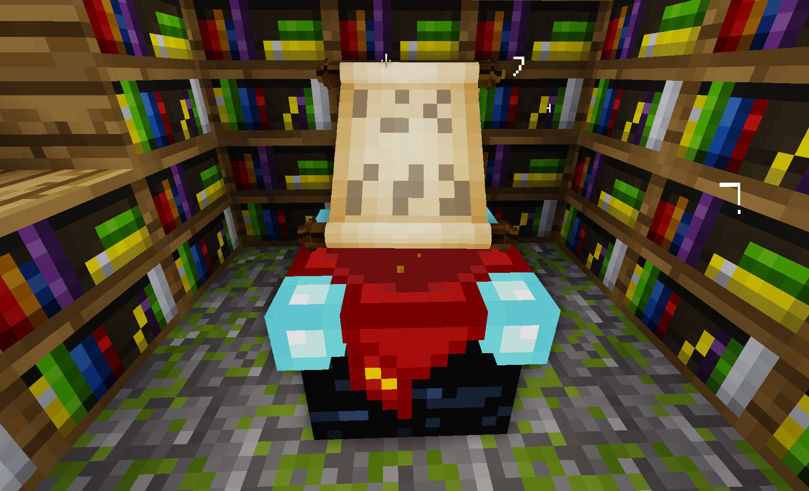

# Enchanting Table and API [x_enchanting]

Adds Enchanting Mechanics and API.

## Features

* adds enchanting table
* supports all registered tools with known tool groups: pickaxe, shovel, axe, sword, e.g. `groups = {pickaxe = 1}`
* supports `default:bookshelf` or anything with `group:bookshelf`
* enchanting trade is for `default:mese_crystal` or anything with `groups = {enchanting_trade = 1}`
* adds enchantability for all MT default tools, for custom tools the enchantability can be set in the item group, e.g. `groups = {enchantability = 15}`
* uses only MT engine mechanics (e.g. tool capabilities)
* enchanted items have detailed enchantments description/short description
* mesh node model
* mesh entity model and animations

NOTE: item inventory/wield image will not be adjusted until this feature is supported by MT engine, see: https://github.com/minetest/minetest/issues/5686

## How To

### Enchanting Setup

For maximum level of enchantments you need maximum of 15 bookshelfs around the enchanting table, maximum of 2 blocks away. Maximum level is 30.

### Enchanting Table

To be able to enchant items you need a trade item (by default `default:mese_crystal` or anything with `groups = {enchanting_trade = 1}`). Higher level enchantments costs more: level 1,2,3 costs mese crystals 1,2,3.
When place item in the enchantment table item slot you can see three buttons with:
- left side the trade cost amount
- middle the enchantment you will get + maybe more enchantments
- right side the base level for the enchantment (depends on how many bookshelfs are in reach)
When you place item in the enchantment table trade slot you will see that some buttons are now enabled and can be clicked on - depends on trade amount available.
The enchantments shown in the enchantment table will be always the same for item - this will change after you enchant an item. After enchanting an item a new enchantments will be shown.

### Item Enchantability

All default tools have enchantability set. Higher enchantability = higher chance of getting better enchantments.
Items enchantibility from worst to best:
- stone
- diamond
- steel
- wood / mese
- bronze

### Every Enchantment Explained

#### Sharpness

Increases melee damage.

#### Fortune

Increases the number and/or chances of specific item drops. This value is not used in the engine; it is the responsibility of the game/mod code to implement this.

#### Unbreaking

Increases the item's durability.

#### Efficiency

Increases the player's mining speed. Also adds mining groupcaps to item, e.g. enchanted wood pickaxe can mine level 1 nodes (e.g. obsidian) after enchantment.

## Dependencies

- none

## Optional Dependencies

- xdecor (adjusts conflicting recipe)

## License:

### Code

GNU Lesser General Public License v2.1 or later (see included LICENSE file)

### Textures

**CC BY-SA 4.0, Pixel Perfection by XSSheep**, https://minecraft.curseforge.com/projects/pixel-perfection-freshly-updated

- x_enchanting_symbol_1.png
- x_enchanting_symbol_2.png
- x_enchanting_symbol_3.png
- x_enchanting_symbol_4.png
- x_enchanting_symbol_5.png
- x_enchanting_symbol_6.png
- x_enchanting_symbol_7.png
- x_enchanting_symbol_8.png
- x_enchanting_symbol_9.png
- x_enchanting_symbol_10.png
- x_enchanting_symbol_11.png
- x_enchanting_symbol_12.png
- x_enchanting_symbol_13.png
- x_enchanting_symbol_14.png
- x_enchanting_symbol_15.png
- x_enchanting_symbol_16.png
- x_enchanting_symbol_17.png
- x_enchanting_symbol_18.png
- x_enchanting_symbol_19.png
- x_enchanting_symbol_20.png
- x_enchanting_symbol_21.png
- x_enchanting_symbol_22.png
- x_enchanting_symbol_23.png
- x_enchanting_symbol_24.png
- x_enchanting_symbol_25.png
- x_enchanting_symbol_26.png

**LGPL-2.1-or-later, by SaKeL**

- x_enchanting_image_button_disabled.png
- x_enchanting_image_button.png
- x_enchanting_image_trade_1.png -- Derived from a texture by VanessaE (CC BY-SA 3.0)
- x_enchanting_image_trade_2.png -- Derived from a texture by VanessaE (CC BY-SA 3.0)
- x_enchanting_image_trade_3.png -- Derived from a texture by VanessaE (CC BY-SA 3.0)
- x_enchanting_scroll_handles_mesh.png -- Derived from a textures by paramat (CC BY-SA 3.0) and TumeniNodes (CC BY-SA 3.0)
- x_enchanting_scroll_mesh.png -- Derived from a texture TumeniNodes (CC BY-SA 3.0)
- x_enchanting_scroll_particle.png
- x_enchanting_table.png
- x_enchanting_trade_slot.png

### Models

**LGPL-2.1-or-later, by SaKeL**

- x_enchanting_scroll.b3d
- x_enchanting_table.obj

### Sounds

**Mixkit Sound Effects Free License**, Sound effects obtained from https://mixkit.co

- x_enchanting_enchant.ogg

**Standard License**, Sound effects obtained from https://mixkit.co

- x_enchanting_scroll.1.ogg
- x_enchanting_scroll.2.ogg
- x_enchanting_scroll.3.ogg
- x_enchanting_scroll.4.ogg
- x_enchanting_scroll.5.ogg
- x_enchanting_scroll.6.ogg
- x_enchanting_scroll.7.ogg
- x_enchanting_scroll.8.ogg
- x_enchanting_scroll.9.ogg
- x_enchanting_scroll.10.ogg
- x_enchanting_scroll.11.ogg
- x_enchanting_scroll.12.ogg
- x_enchanting_scroll.13.ogg
- x_enchanting_scroll.14.ogg

## Installation

see: https://wiki.minetest.net/Installing_Mods
